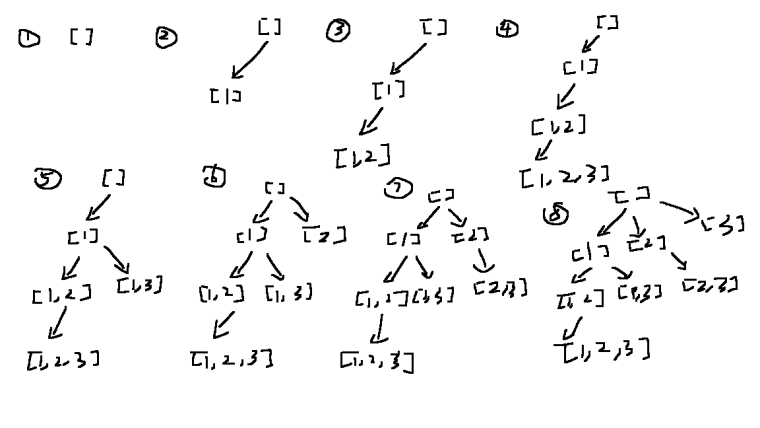

# Notes
- Try to make a tree and branches

## Backtracking
In the backtracking process, notice that in each step, move id a step forward(Subsets) or keep it same(Combination Sum).
This helps to avoid duplicates according to order e.g (1,3) and (3,1) Check [here](https://www.youtube.com/watch?v=XovjRfHumDU)

